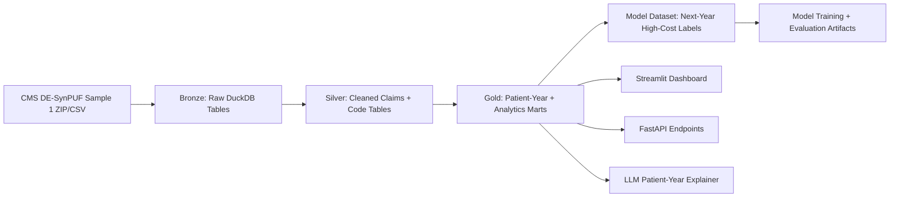
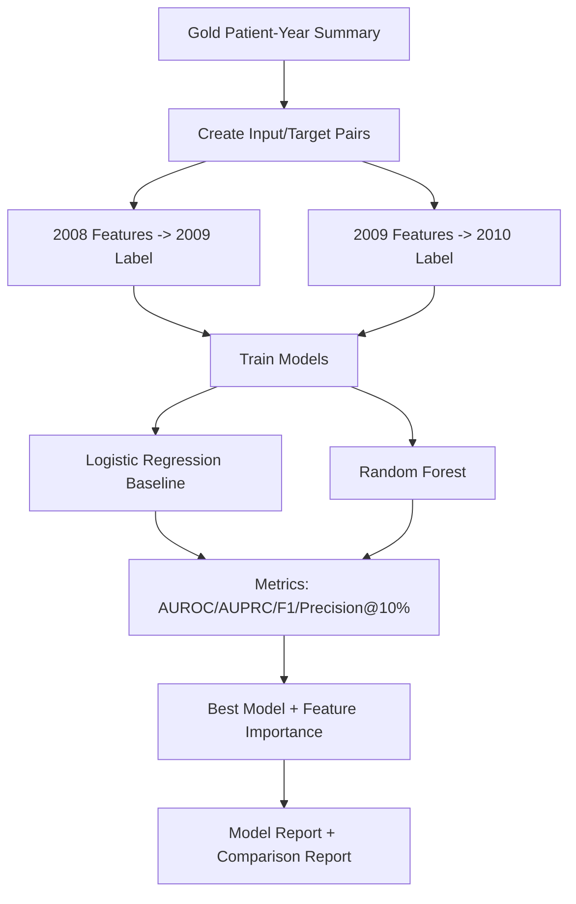

# Medicare Claims Data Engineering Pipeline using CMS DE-SynPUF

Professor-facing title:

**A Reproducible Medicare Claims Data Engineering and Analytics Pipeline using CMS Synthetic Public Use Files**

This project builds a reproducible healthcare claims analytics pipeline using the CMS 2008-2010 Data Entrepreneurs' Synthetic Public Use File (DE-SynPUF). The first milestone focuses on a local DuckDB warehouse with Bronze, Silver, and Gold layers, a patient-year analytics mart, a basic Streamlit dashboard, and foundations for high-cost beneficiary prediction and safe LLM-based explanations.

## Why This Dataset

CMS describes DE-SynPUF as a public synthetic Medicare-style claims dataset intended for software development, training, and privacy-preserving data mining. CMS also notes that DE-SynPUF has limited inferential research value because it is synthetic, so this project treats all outputs as engineering and analytics demonstrations rather than clinical evidence.

Primary CMS sources:

- CMS DE-SynPUF overview: <https://www.cms.gov/data-research/statistics-trends-and-reports/medicare-claims-synthetic-public-use-files/cms-2008-2010-data-entrepreneurs-synthetic-public-use-file-de-synpuf>
- CMS DE1.0 Sample 1 downloads: <https://www.cms.gov/data-research/statistics-trends-and-reports/medicare-claims-synthetic-public-use-files/cms-2008-2010-data-entrepreneurs-synthetic-public-use-file-de-synpuf/de10-sample-1>
- CMS SynPUF landing page: <https://www.cms.gov/data-research/statistics-trends-and-reports/medicare-claims-synthetic-public-use-files>

## Current Milestone

**Milestone 1: Claims Data Warehouse MVP**

Implemented scaffold:

- Repository structure for data engineering, analytics, modeling, dashboard, API, tests, and docs.
- DuckDB ingestion script for CMS Sample 1 CSV/ZIP files.
- Bronze-to-Silver cleaning scripts for beneficiary, inpatient, outpatient, carrier, and PDE data.
- Gold patient-year summary and high-cost prediction dataset builders.
- Streamlit dashboard shell with overview, cost, utilization, risk model, and patient explainer pages.
- FastAPI service for patient-year lookup and safe synthetic explanations.
- Initial notebooks and pytest coverage using small synthetic fixtures.

## Architecture

```text
CMS DE-SynPUF Sample 1 files
        |
        v
Bronze DuckDB tables
raw imported files with standardized column names
        |
        v
Silver DuckDB tables
clean beneficiary, claim, prescription, diagnosis, and procedure tables
        |
        v
Gold DuckDB marts
patient-year features, utilization, costs, chronic-condition summaries,
and high-cost prediction labels
        |
        v
Streamlit dashboard + FastAPI + ML + LLM explanation layer
```

## Project Infographics

### 1) End-to-End Data Engineering Pipeline



### 2) High-Cost Prediction Workflow



### 3) Product Surface (What You Can Demo)

```mermaid
flowchart LR
    A[DuckDB Warehouse] --> B[Streamlit Frontend]
    A --> C[FastAPI Backend]
    A --> D[Quality Validation]
    A --> E[LLM Explanation Report]
    C --> F[/overview + /analytics endpoints]
    C --> G[/patient-year + /explain]
    C --> H[/model + /quality artifacts]
    B --> I[Overview / Cost / Utilization]
    B --> J[Risk Model Diagnostics]
    B --> K[Patient Explainer]
```

Detailed docs:

- [Architecture](docs/architecture.md)
- [Schema and lineage](docs/schema_lineage.md)
- [Data dictionary](docs/data_dictionary.md)
- [Quality checks](docs/quality_checks.md)
- [Dashboard](docs/dashboard.md)
- [API](docs/api.md)
- [Modeling](docs/modeling.md)
- [LLM explainer](docs/llm_explainer.md)

## Setup

```bash
python3 -m venv .venv
source .venv/bin/activate
pip install -r requirements.txt
```

Download DE1.0 Sample 1 from CMS and place the ZIP or CSV files in:

```text
data/raw/
```

Do not commit raw, interim, or processed data.

## Run The Pipeline

If you have not downloaded CMS Sample 1 yet, run the tiny synthetic demo smoke test first:

```bash
make demo-all
DESYNPUF_DB=data/processed/demo_desynpuf.duckdb make dashboard
```

For the real CMS Sample 1 workflow:

```bash
make ingest
make transform
make validate
make train
make explain
make packet
make dashboard
```

Equivalent direct commands:

```bash
python3 -m src.ingest.load_raw_files --raw-dir data/raw --db data/processed/desynpuf.duckdb
python3 -m src.transform.build_claims_mart --db data/processed/desynpuf.duckdb
python3 -m src.quality.validate_warehouse --db data/processed/desynpuf.duckdb
python3 -m src.models.train_high_cost_model --db data/processed/desynpuf.duckdb
python3 -m src.llm.generate_explanation_report --db data/processed/desynpuf.duckdb
python3 -m src.reports.generate_professor_packet --context real --output docs/latest_professor_packet.md
streamlit run dashboard/streamlit_app.py
uvicorn src.api.main:app --reload
```

## Run Tests

```bash
pytest -q
```

The fastest end-to-end verification is:

```bash
make demo-all
```

This also writes aggregate quality reports to:

- `data/processed/demo_quality_report.json`
- `docs/demo_quality_report.md`

## Outputs

The default DuckDB database is written to:

```text
data/processed/desynpuf.duckdb
```

Main tables:

- `silver_beneficiaries`
- `silver_inpatient_claims`
- `silver_outpatient_claims`
- `silver_carrier_claims`
- `silver_prescription_events`
- `silver_diagnosis_codes`
- `silver_procedure_codes`
- `gold_patient_year_summary`
- `gold_patient_utilization_summary`
- `gold_patient_cost_summary`
- `gold_patient_chronic_condition_summary`
- `gold_high_cost_prediction_dataset`

## Responsible Use

DE-SynPUF is synthetic. It is appropriate for portfolio demonstrations of claims data engineering, longitudinal feature engineering, dashboards, and ML workflow design. It should not be presented as real-world clinical evidence or used for patient care decisions.
