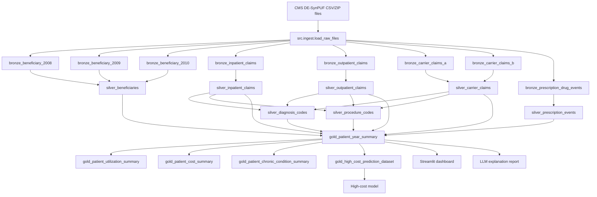

# Schema And Lineage

This page summarizes the current warehouse lineage. The production build is implemented with DuckDB SQL generated from Python so the pipeline can tolerate CMS file variants.

## Primary Keys And Grains

| Table | Grain |
| --- | --- |
| `silver_beneficiaries` | `beneficiary_id`, `year` |
| `silver_inpatient_claims` | one inpatient claim |
| `silver_outpatient_claims` | one outpatient claim |
| `silver_carrier_claims` | one carrier/professional claim |
| `silver_prescription_events` | one prescription drug event |
| `silver_diagnosis_codes` | one diagnosis-code position per claim |
| `silver_procedure_codes` | one procedure/HCPCS-code position per claim |
| `gold_patient_year_summary` | `beneficiary_id`, `year` |
| `gold_high_cost_prediction_dataset` | `beneficiary_id`, `input_year`, `target_year` |

## Validation

The quality checker validates required tables, required Gold columns, non-null patient-year keys, unique patient-year grain, valid years, nonnegative measures, and next-year model-label consistency.
